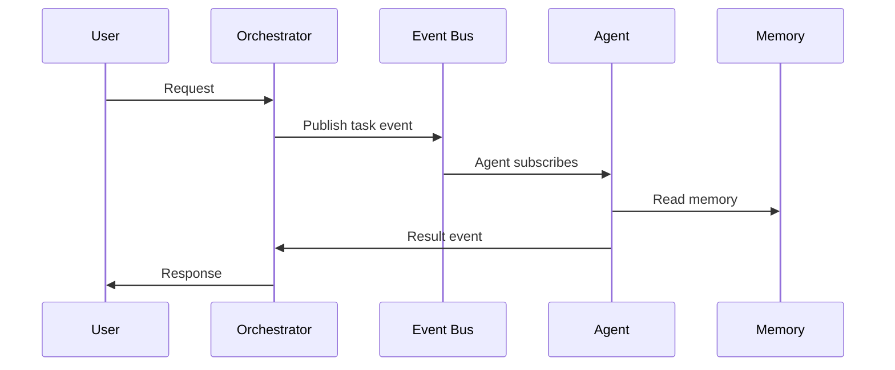

# PAI Architecture Patterns (2026)

**Scope:** Deep research on Personal AI (PAI) architecture patterns: agent communication protocols, memory systems, orchestration patterns, and recommendations for an 18‑agent Athena stack.

---

## 1) Agent Communication Protocols

### Comparison Table

| Protocol | Strengths | Weaknesses | Best Fit |
|---|---|---|---|
| REST (HTTP/JSON) | Ubiquitous tooling, easy debugging, stateless scalability | Higher latency, verbose payloads, weaker streaming | Simple agent-to-service calls, external APIs |
| gRPC (HTTP/2 + Protobuf) | Low latency, strict schema, bidirectional streaming | More setup, harder debugging, binary payloads | High-frequency internal agent RPC, streaming tools |
| Message Queues (RabbitMQ, Kafka) | Decoupling, buffering, retries, fan-out | Operational overhead, eventual consistency | Task distribution, asynchronous coordination |

#### REST
- **Pros:** Easy to implement, human-readable logs, broad ecosystem.
- **Cons:** Overhead for high‑frequency calls; no built-in streaming semantics.
- **Usage in PAI:** External tool calls, low-frequency internal requests.

#### gRPC
- **Pros:** Efficient for high-throughput agent calls; streaming for partial outputs.
- **Cons:** Requires schema registry (protobufs), harder to inspect without tooling.
- **Usage in PAI:** Internal agent communication, tool invocation, telemetry streaming.

#### Message Queues (RabbitMQ, Kafka)
- **Pros:** Event-driven patterns, durable workflows, backpressure.
- **Cons:** Complex operations; latency variability.
- **Usage in PAI:** Task dispatch, multi-agent coordination, long-running workflows.

### OpenClaw Session Tools / LangChain / AutoGen Patterns

- **OpenClaw:** Session-based command routing; agents are isolated sessions with tool calls and shared files as implicit state. Good for deterministic routing but needs standardized message schemas.
- **LangChain:** Agent executors and toolkits; common pattern is chain-of-tools with memory objects. Often centralized orchestration.
- **AutoGen:** Conversational agent mesh; agents communicate via message brokers and role-based policies. Strong for multi-agent debate/consensus.

**Key takeaway:**
- Use **gRPC** or **NATS** for internal agent RPC and streaming.
- Use **MQ** for async task dispatch and cross-agent workflows.
- Keep REST for external/public APIs.

---

## 2) Memory Systems

### Vector Databases

| Vector DB | Strengths | Weaknesses | Fit |
|---|---|---|---|
| Pinecone | Managed, scalable, high uptime | Cost, vendor lock-in | Production scale, hosted SaaS |
| Weaviate | Hybrid search (BM25 + vectors), self-host | Ops complexity | Self-hosted, hybrid search |
| Chroma | Lightweight, dev-friendly | Scaling limits | Local dev or small stacks |

### Hybrid Hot/Cold Memory (Redis + PostgreSQL)

**Pattern:**
- **Hot memory:** Redis for session context, recent embeddings, short-lived caches.
- **Cold memory:** PostgreSQL for durable knowledge, structured metadata, audit trails.

**Pros:**
- Fast retrieval with Redis + durable storage with Postgres.
- Easy pruning of short-term memory while preserving core knowledge.

**Cons:**
- Requires synchronization logic between Redis and Postgres.

### Semantic Search Patterns

1. **Query-time embedding**
   - Embed user query → ANN search in vector DB → re-rank.
2. **Hybrid lexical + semantic**
   - BM25 (keyword) + vector search combined with weighted scoring.
3. **Temporal decay weighting**
   - Boost recent memory in Redis, decay older memories in Postgres.
4. **Summary compression**
   - Periodically summarize long threads into a “memory chunk” for long-term storage.

---

## 3) Orchestration Patterns

### Centralized vs Decentralized

| Pattern | Pros | Cons | Fit |
|---|---|---|---|
| Centralized Orchestrator | Clear control, easier debugging, global scheduling | Single point of failure, bottleneck | Small-medium agent fleets |
| Decentralized (Mesh) | Resilience, local autonomy | Harder to enforce policy, complexity | Large agent swarms, experimental systems |

### Event-Driven Architectures

- **NATS:** Lightweight, low-latency pub/sub, good for real-time agent events.
- **Redis Streams:** Persistent event logs, easier ops if Redis already in stack.

### Consensus Mechanisms

- **Majority Vote:** Simple, fast; risk of groupthink.
- **Weighted Vote:** Assign weights based on agent reliability or domain expertise.
- **Deliberative Consensus (AutoGen style):** Agents debate, then converge; slower but higher quality.

---

## 4) Architecture Diagrams

### 4.1 Hybrid PAI Stack (Recommended)

```mermaid
flowchart LR
  subgraph Agents[Agent Mesh]
    A1[Athena Core] --- A2[Planner]
    A3[Research] --- A4[Builder]
    A5[QA/Verifier] --- A6[Ops/Telemetry]
  end

  subgraph Orchestrator
    O[Central Orchestrator]
  end

  subgraph Comms
    R[REST Gateway]
    G[gRPC Internal RPC]
    MQ[Event Bus (NATS/Redis Streams)]
  end

  subgraph Memory
    V[Vector DB]
    H[Redis Hot Cache]
    P[(PostgreSQL Cold Store)]
  end

  Agents --> O
  O --> G
  O --> MQ
  O --> R
  G --> Memory
  MQ --> Memory
  R --> Memory
```

### 4.2 Event-Driven Task Flow



---

## 5) Recommended Stack for Athena (18 Agents)

**Goal:** Scale from 13 → 18 agents with reliability, observability, and consistent memory.

### Communication
- **Internal RPC:** gRPC for agent-to-agent and agent-to-orchestrator calls.
- **Async Tasks:** NATS or Redis Streams for decoupled event-driven work.
- **External APIs:** REST gateway with rate limiting.

### Memory
- **Hot:** Redis (session context, recent embeddings, agent scratchpad).
- **Cold:** PostgreSQL (knowledge base, structured metadata, audits).
- **Semantic:** Weaviate or Pinecone depending on ops budget. Weaviate if self-host; Pinecone if managed.

### Orchestration
- **Central Orchestrator** (Athena Core) with explicit policy rules and routing.
- **Consensus:** Weighted voting with fallback to deliberative consensus for critical tasks.

### Observability
- OpenTelemetry tracing + centralized logging.
- Metrics for: agent latency, tool failures, memory hit rates.

---

## 6) Implementation Roadmap (Phased)

### Phase 0 — Baseline (1–2 weeks)
- Standardize agent message schema (priority, intent, tool call, memory tags).
- Introduce Redis hot memory for session context.
- Add NATS or Redis Streams for async tasks.

### Phase 1 — Internal RPC (2–4 weeks)
- Define protobuf schemas for key agent RPCs.
- Implement gRPC layer for internal calls.
- Add tracing IDs to all requests.

### Phase 2 — Memory Hybridization (4–6 weeks)
- Stand up Postgres cold memory store.
- Implement periodic summarization of chat logs into long-term memory.
- Add semantic search layer (Weaviate or Pinecone).

### Phase 3 — Orchestration & Consensus (6–8 weeks)
- Build orchestration policy rules engine.
- Implement consensus strategies (majority, weighted, deliberative).
- Add failover logic: degraded mode if orchestrator down.

### Phase 4 — Optimization (8+ weeks)
- Optimize embedding caching with Redis.
- Dynamic agent scaling based on workload.
- Continuous quality evaluation with QA agent loop.

---

## 7) Pros/Cons Summary by Pattern

### REST vs gRPC vs MQ
- **REST:** best for external APIs, slower internally.
- **gRPC:** fastest for internal RPC and streaming.
- **MQ:** best for decoupled async workflows.

### Centralized vs Decentralized
- **Centralized:** simpler control, easier debugging.
- **Decentralized:** resilient but complex.

### Event-Driven vs Direct RPC
- **Event-driven:** resilience + scalability.
- **Direct RPC:** predictable latency.

---

## Final Recommendation

For Athena’s 18-agent evolution, adopt a **hybrid architecture**:

- **Central orchestrator** with explicit routing rules
- **gRPC** for internal RPC
- **NATS or Redis Streams** for event bus
- **Redis + Postgres** for hot/cold memory
- **Vector DB** for semantic retrieval
- **Weighted consensus** for critical decisions

This yields **low latency**, **scalability**, and **reliable memory** while keeping complexity manageable.
